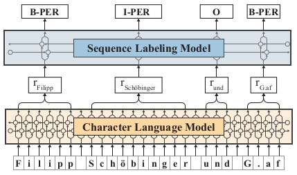
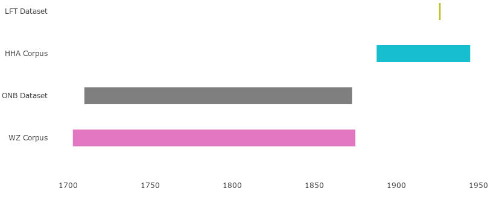
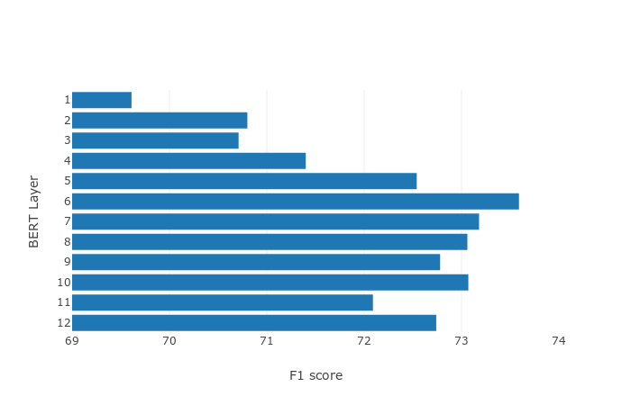
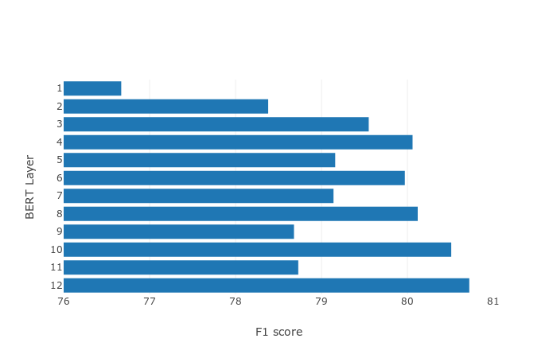

# Towards Robust Named Entity Recognition for Historic German

This repository contains all code and data for the
"Towards Robust Named Entity Recognition for Historic German" paper, that was
accepted at [4th Workshop on Representation Learning for NLP](https://sites.google.com/view/repl4nlp2019/accepted-papers)
(RepL4NLP) at ACL 2019.

# Abstract

Recent advances in language modeling using deep neural networks have shown that
these models learn representations, that vary with the network depth from
morphology to semantic relationships like co-reference. We apply pre-trained
language models to low-resource named entity recognition for Historic German.
We show on a series of experiments that character-based pre-trained language
models do not run into trouble when faced with low-resource datasets.
Our pre-trained character-based language models improve upon classical
CRF-based methods and previous work on Bi-LSTMs by boosting F1 score
performance by up to 6%.

# Introduction

Named entity recognition (NER) is a central component in natural language
processing tasks. Identifying named entities is a key part in systems e.g.
for question answering or entity linking. Traditionally, NER systems are built
using conditional random fields (CRFs). Recent systems are using neural network
architectures like bidirectional LSTM with a CRF-layer ontop and pre-trained
word embeddings ([Ma and Hovy, 2016](http://aclweb.org/anthology/P16-1101);
[Lample et al., 2016a](http://aclweb.org/anthology/N16-1030);
[Reimers and Gurevych, 2017](http://aclweb.org/anthology/D17-1035);
[Lin et al., 2017](http://aclweb.org/anthology/W17-4421)).

Pre-trained word embeddings have been shown to be of great use for downstream
NLP tasks ([Mikolov et al., 2013](https://papers.nips.cc/paper/5021-distributed-representations-of-words-and-phrases-and-their-compositionality.pdf);
[Pennington et al., 2014](https://www.aclweb.org/anthology/D14-1162)). Many
recently proposed approaches go beyond these pre-trained embeddings. Recent
works have proposed methods that produce different representations for the same
word depending on its contextual usage
([Peters et al., 2017](http://aclweb.org/anthology/P17-1161),[2018a](https://aclweb.org/anthology/N18-1202);
[Akbik et al., 2018](https://www.aclweb.org/anthology/C18-1139);
[Devlin et al., 2018](https://arxiv.org/abs/1810.04805)).
These methods have shown to be very powerful in the fields of named entity
recognition, coreference resolution, part-of-speech tagging and question
answering, especially in combination with classic word embeddings.

Our paper is based on the work of [Riedl and Padó (2018)](http://aclweb.org/anthology/P18-2020).
They showed how to build a
model for German named entity recognition (NER) that performs at the state of
the art for both contemporary and historical texts. Labeled historical texts
for German named entity recognition are a low-resource domain. In order to
achieve robust state-of-the-art results for historical texts they used
transfer-learning with labeled data from other high-resource domains like
CoNLL-2003 ([Tjong Kim Sang and De Meulder, 2003](http://aclweb.org/anthology/W03-0419))
or GermEval ([Benikova et al., 2014](http://www.lrec-conf.org/proceedings/lrec2014/pdf/276_Paper.pdf)).
They showed that using Bi-LSTM with a CRF as the top layer and word embeddings
outperforms CRFs with hand-coded features in a big-data situation.

We build up upon their work and use the same low-resource datasets for Historic
German. Furthermore, we show how to achieve new state-of-the-art results for
Historic German named entity recognition by using only unlabeled data via
pre-trained language models and word embeddings. We also introduce a novel
language model pre-training objective, that uses only contemporary texts for
training to achieve comparable state-of-the-art results on historical texts.

# Model

In this paper, we use contextualized string embeddings as proposed by
[Akbik et al., (2018)](https://www.aclweb.org/anthology/C18-1139), as they have
shown to be very effective in named entity recognition. We use the
[*Flair*](https://github.com/zalandoresearch/flair) ([Akbik et al., 2018](https://www.aclweb.org/anthology/C18-1139))
library to train all NER and pre-trained language models. We use FastText
(Wikipedia and Crawl) as word embeddings. *Flair* allows us to easily combine
("stacking") different embeddings types. For instance,
[Lample et al. (2016b)](https://www.aclweb.org/anthology/N16-1030) combine word
embeddings with character features. In our experiments we combined several
embedding types and language models. Contextualized string embeddings were
trained with a forward and backward character-based language model (LSTM) on
two historic datasets. This process is further called "pre-training". We use a
Bi-LSTM with CRF on top as proposed by [Huang et al. (2015)](https://ui.adsabs.harvard.edu/\#abs/2015arXiv150801991H).

The next figure shows a high level overview of our used model. A sentence is
input as a character sequence into a pre-trained bidirectional character
language model. From this LM, we retrieve for each word a contextual embedding
that we pass into a vanilla Bi-LSTM-CRF:

# Datasets

We use the same two datasets for Historic German as used by [Riedl and Padó (2018)](http://aclweb.org/anthology/P18-2020).
These datasets are based on historical texts that were extracted
([Neudecker, 2016](https://www.aclweb.org/anthology/L16-1689)) from the
Europeana collection of [historical newspapers](https://www.europeana.eu/portal/de).
The first corpus is the collection of Tyrolean periodicals and newspapers from
the Dr Friedrich Temann Library (LFT). The LFT corpus consists of approximately
87,000 tokens from 1926. The second corpus is a collection of Austrian newspaper
texts from the Austrian National Library (ONB). The ONB corpus consists of
approximately 35,000 tokens from texts created between 1710 and 1873.

The tagset includes locations (LOC), organizations (ORG), persons (PER) and the
remaining entities as miscellaneous (MISC). The next tables contain an overview
of the number of named entities of the two datasets. No miscellaneous entities
(MISC) are found in the ONB dataset and only a few are annotated in the LFT
dataset. The two corpora pose three challenging problems: they are relatively
small compared to contemporary corpora like CoNLL-2003 or GermEval. They also
have a different language variety (German and Austrian) and they include a high
rate of OCR errors (Typical OCR errors would be segmentation and hyphenation
errors or misrecognition of characters (e.g. *Bifmarck* instead of *Bi∫marck*)
since they were originally printed in Gothic type-face (Fraktur), a low resource
font, which has not been the main focus of recent OCR research.

The following table shows the number of named entities in the ONB dataset:

| Dataset     | LOC   | MISC | ORG | PER
| ----------- | ----- | ---- | --- | -----
| Training    | 1,605 |    0 | 182 | 2,674
| Development |   207 |    0 |  10 |   447
| Test        |   221 |    0 |  16 |   355

The following table shows the number of named entities in the LFT dataset:

| Dataset     | LOC   | MISC | ORG   | PER
| ----------- | ----- | ---- | ----- | -----
| Training    | 3,998 |    2 | 2,293 | 4,009
| Development |   406 |    0 |   264 |   558
| Test        |   441 |    1 |   324 |   506

# Experiments

## Experiment 1: Different Word Embeddings

In the first experiment we use different types of embeddings on the two
datasets: (a) FastText embeddings trained on German Wikipedia articles,
(b) FastText embeddings trained on Common Crawl and (c) character embeddings,
as proposed by [Lample et al. (2016a)](http://aclweb.org/anthology/N16-1030).
We use pre-trained [FastText embeddings](https://fasttext.cc/docs/en/crawl-vectors.html)
without subword information, as we found out that subword information could harm
performance (0.8 to 1.5%) of our system in some cases.

The following table shows, that combining pre-trained
FastText for Wikipedia and Common Crawl leads to a F1 score of 72.50% on the LFT
dataset. Adding character embeddings has a positive impact of 2% and yields
74.50%. This result is higher than the reported one by
[Riedl and Padó (2018)](http://aclweb.org/anthology/P18-2020) (74.33%), who
used transfer-learning with more labeled data. The following table also shows
the same effect for ONB: combining Wikipedia and Common Crawl embeddings leads
to 79.46% and adding character embeddings marginally improves the result to
80.48%. This result is also higher than the reported one by
[Riedl and Padó (2018)](http://aclweb.org/anthology/P18-2020) (78.56%).

| Dataset | Configuration                                                                          | F-Score
| ------- | -------------------------------------------------------------------------------------- | ----------
| LFT     | Wikipedia                                                                              | 69.59%
| LFT     | CommonCrawl                                                                            | 68.97%
| LFT     | Wikipedia + CommonCrawl                                                                | 72.00%
| LFT     | Wikipedia + CommonCrawl + Character                                                    | **74.50**%
| LFT     | [Riedl and Padó (2018)](http://aclweb.org/anthology/P18-2020) (no transfer-learning)   | 69.62%
| LFT     | [Riedl and Padó (2018)](http://aclweb.org/anthology/P18-2020) (with transfer-learning) | 74.33%
| ONB     | Wikipedia                                                                              | 75.80%
| ONB     | CommonCrawl                                                                            | 78.70%
| ONB     | Wikipedia + CommonCrawl                                                                | 79.46%
| ONB     | Wikipedia + CommonCrawl + Character                                                    | **80.48**%
| ONB     | [Riedl and Padó (2018)](http://aclweb.org/anthology/P18-2020) (no transfer-learning)   | 73.31%
| ONB     | [Riedl and Padó (2018)](http://aclweb.org/anthology/P18-2020) (with transfer-learning) | 78.56%

## Experiment 2: Language model pre-training

For the next experiments we train contextualized string embeddings as proposed
by [Akbik et al., (2018)](https://www.aclweb.org/anthology/C18-1139). We train
language models on two datasets from the Europeana collection of historical
newspapers. The first corpus consists of articles from the Hamburger Anzeiger
newspaper (HHA) covering 741,575,357 tokens from 1888 - 1945. The second corpus
consists of articles from the Wiener Zeitung newspaper (WZ) covering
801,543,845 tokens from 1703 - 1875. We choose the two corpora, because they
have a temporal overlap with the LFT corpus (1926) and the ONB corpus
(1710 - 1873). The next figure shows the temporal overlap
for the language model corpora and the datasets used in the downstream task.
There is a huge temporal overlap between the ONB dataset and the WZ corpus,
whereas the overlap between the LFT dataset and the HHA corpus is relatively
small.

Additionally we use the  BERT model, that was trained on Wikipedia for 
[104 languages](https://github.com/google-research/bert/blob/f39e881b169b9d53bea03d2d341b31707a6c052b/multilingual.md)
for comparison. We perform a per-layer analysis of the multi-lingual BERT model
on the development set to find the best layer for our task. For the German
language model, we use the same pre-trained language model for German as used in
[Akbik et al., (2018)](https://www.aclweb.org/anthology/C18-1139). This model
was trained on various sources (Wikipedia, OPUS) with a training data set size
of half a billion tokens.

The next table shows that the temporal aspect of training data for the language
models has deep impact on the performance. On LFT (1926) the language model
trained on the HHA corpus (1888 - 1945) leads to a F1 score of 77.51%, which
is a new state-of-the art result on this dataset. The result is 3.18% better
than the result reported by [Riedl and Padó (2018)](http://aclweb.org/anthology/P18-2020),
which uses transfer-learning with more labeled training data. The language model
trained on the WZ corpus (1703-1875) only achieves a F1 score of 75.60%, likely
because the time period of the data used for pre-training (19th century) is too
far removed from that of the downstream task (mid-1920s). The next table also
shows the results of pre-trained language models on the ONB (1710 - 1873)
dataset. The language models, that were trained on contemporary data like the
German Wikipedia ([Akbik et al., 2018](https://www.aclweb.org/anthology/C18-1139))
or multi-lingual BERT  do not perform very well on the ONB dataset, which covers
texts from the 18-19th century. The language model trained on the HHA corpus
performs better, since there is a substantially temporal overlap with the ONB
corpus. The language model trained on the WZ corpus (1703-1875) leads to the
best results with a F1 score of 85.31%. This result is 6.75% better than the
reported result by [Riedl and Padó (2018)](http://aclweb.org/anthology/P18-2020),
which again uses transfer-learning with additionally labeled training data.

## Experiment 3: Synthetic Masked Language Modeling (*SMLM*)

We also consider the masked language modeling (*SMLM*) objective of [Devlin et al. (2018)](https://arxiv.org/abs/1810.04805).
However, this technique cannot be directly used, because they use a
subword-based language model, in contrast to our character-based language model.
We introduce a novel masked language modeling technique, synthetic masked
language modeling (*SMLM*) that randomly adds noise during training.

The main motivation for using *SMLM* is to transfer a corpus from one domain
(e.g. "clean" contemporary texts) into another (e.g. "noisy" historical texts).
*SMLM* uses the vocabulary (characters) from the target domain and injects them
into the source domain. With this technique it is possible to create a synthetic
corpus, that "emulates" OCR errors or spelling mistakes without having any data
from the target domain (except all possible characters as vocabulary).
Furthermore, *SMLM* can also be seen as a kind of domain adaption.

To use *SMLM* we extract all vocabulary (characters) from the ONB and LFT
datasets. We refer to these characters as target vocabulary. Then we obtained a
corpus consisting of contemporary texts from Leipzig Corpora Collection ([Goldhahn et al., 2012](http://www.lrec-conf.org/proceedings/lrec2012/pdf/327_Paper.pdf))
for German. The resulting corpus has 388,961,352 tokens. During training, the
following *SMLM* objective is used: Iterate overall characters in the
contemporary corpus. Leave the character unchanged in 90% of the time. For the
remaining 10% we employ the following strategy: in 20% of the time replace the
character with a masked character, that does not exist in the target vocabulary.
In 80% of the time we randomly replace the character by a symbol from the target
vocabulary.

The following table shows that the language model trained with *SMLM* achieves
the second best result on LFT with 77.16%. The ONB corpus is more challenging
for *SMLM*, because it includes texts from a totally different time period
(18-19th century). *SMLM* achieves the third best result with a F-Score of
82.15%. This result is remarkable, because the language model itself has never
seen texts from the 18-19th century. The model was trained on contemporary texts
with *SMLM* only.

The following table shows results on LFT and ONB with different language models.
The German language model refers to the model used in [Akbik et al., (2018)](https://www.aclweb.org/anthology/C18-1139).
We perform a per-layer analysis for BERT on the development set and use the best
layer. For all experiments we also use pre-trained FastText embeddings on
Wikipedia and Common Crawl as well as character embeddings. † indicates the
usage of additional training data (GermEval) for transfer learning.

| Dataset           | Configuration                                                  | Pre-trained LM | Pre-training data       | F-Score
| ----------------- | -------------------------------------------------------------- | -------------- | ----------------------- | -------
| LFT (1926)        | German                                                         | ✓              | Wikipedia, OPUS         | 76.04%
| LFT (1926)        | Hamburger Anzeiger (HHA)                                       | ✓              | Newspaper (1888 - 1945) | **77.51%**
| LFT (1926)        | Wiener Zeitung (WZ)                                            | ✓              | Newspaper (1703 - 1875) | 75.60%
| LFT (1926)        | Multi-lingual BERT                                             | ✓              | Wikipedia               | 74.39%
| LFT (1926)        | *SMLM* (synthetic corpus)                                      | ✓              | Wikipedia               | 77.16%
| LFT (1926)        | [Riedl and Padó (2018)](http://aclweb.org/anthology/P18-2020)  | -              | -                       | 69.62%
| LFT (1926)        | [Riedl and Padó (2018)](http://aclweb.org/anthology/P18-2020)† | -              | -                       | 74.33%
| ONB (1710 - 1873) | German                                                         | ✓              | Wikipedia, OPUS         | 80.06%
| ONB (1710 - 1873) | Hamburger Anzeiger (HHA)                                       | ✓              | Newspaper (1888 - 1945) | 83.28%
| ONB (1710 - 1873) | Wiener Zeitung (WZ)                                            | ✓              | Newspaper (1703 - 1875) | **85.31%**
| ONB (1710 - 1873) | Multi-lingual BERT                                             | ✓              | Wikipedia               | 77.19%
| ONB (1710 - 1873) | *SMLM* (synthetic corpus)                                      | ✓              | Wikipedia               | 82.15%
| ONB (1710 - 1873) | [Riedl and Padó (2018)](http://aclweb.org/anthology/P18-2020)  | -              | -                       | 73.31%
| ONB (1710 - 1873) | [Riedl and Padó (2018)](http://aclweb.org/anthology/P18-2020)† | -              | -                       | 78.56%

# Data Analysis

The usage of pre-trained character-based language models boosts performance for
both LFT and ONB datasets. The results in the previous table show, that the
selection of the language model corpus plays an important role: a corpus with a
large degree of temporal overlap with the downstream task performs better than
corpus with little to no temporal overlap. In order to compare our trained
language models with each other, we measure both the perplexity of the forward
language model and the backward language model on the test dataset for LFT and
ONB. The perplexity for each sentence in the test dataset is calculated and
averaged. The results for LFT and ONB are shown in the next table.
For all language models (except one) there is a clear correlation between
overall perplexity and F1 score on the test dataset: lower perplexity (both for
forward and backward language model) yields better performance in terms of the
F1 score on the downstream NER tasks. But this assumption does not hold for the
language model that was trained on synthetic data via *SMLM* objective:
The perplexity for this language model (both forward and backward) is relatively
high compared to other language models, but the F1 score results are better than
some other language models with lower perplexity. This variation can be observed
both on LFT and ONB test data. We leave this anomaly here as an open question:
Is perplexity a good measure for comparing language models and a useful
indicator for their results on downstream tasks?

The previous experiments show, that language model pre-training does work very
well, even for domains with low data resources. [Cotterell and Duh (2017)](http://aclweb.org/anthology/I17-2016)
showed that using CRF-based methods outperform traditional Bi-LSTM in
low-resource settings. We argue that this shortcoming can now be eliminated by
using Bi-LSTMs in combination with pre-trained language models. Our experiments
also showed, that pre-trained language models can also help to improve
performance, even when no training data for the target domain is used
(*SMLM* objective).

The next table shows the averaged perplexity for all sentences in the test
dataset for LFT for all pre-trained language models.

| Dataset | LM        | Forward ppl. | Backward ppl. | F-Score
| ------- | --------- | ------------ | ------------- | -------
| LFT     | German    |         8.30 |          8.70 | 76.07%
| LFT     | HHA       |     **6.31** |      **6.64** | **77.51%**
| LFT     | WZ        |         6.72 |          6.97 | 75.60%
| LFT     | Synthetic |         7.87 |          8.20 | 77.16%
| ONB     | German    |         8.58 |          8.77 | 80.06%
| ONB     | HHA       |         6.71 |          7.22 | 83.28%
| ONB     | WZ        |     **4.72** |      **4.95** | **85.31%**
| ONB     | Synthetic |         8.65 |          9.64 | 82.15%

# Conclusion

In this paper we have studied the influence of using language model pre-training
for named entity recognition for Historic German. We achieve new
state-of-the-art results using carefully chosen training data for language
models.

For a low-resource domain like named entity recognition for Historic German,
language model pre-training can be a strong competitor to CRF-only methods as
proposed by [Cotterell and Duh (2017)](http://aclweb.org/anthology/I17-2016).
We showed that language model pre-training can be more effective than using
transfer-learning with labeled datasets.

Furthermore, we introduced a new language model pre-training objective,
synthetic masked language model pre-training (*SMLM*), that allows a transfer
from one domain (contemporary texts) to another domain (historical texts) by
using only the same (character) vocabulary. Results showed that using *SMLM* can
achieve comparable results for Historic named entity recognition, even when they
are only trained on contemporary texts.

# Acknowledgments

We would like to thank the anonymous reviewers for their helpful and valuable
comments.

# Supplemental Material

## Language model pre-training

The next table shows the parameters that we used for training our language
models. As our character-based language model relies on raw text, no
preprocessing steps like tokenization are needed. We use 1/500 of the complete
corpus for development data and another 1/500 for test data during the language
model training.

| Parameter                    | Value 
| ---------------------------- | -----
| LSTM hidden size             | 2048
| LSTM layer                   | 1
| Dropout                      | 0.1
| Sequence length (characters) | 250
| Mini batch size              | 200
| Epochs                       | 1

## *SMLM* objective

The following example shows the *SMLM* objective for a given input sentence and
the corresponding output. The special character "¶" is used as masked character
symbol:

| Input sentence                                                                          | Output sentence
| --------------------------------------------------------------------------------------- | ----------------------------------------------------------------------------------------
| Dann habe der Mann erzählt, wie er in München am Bahnhof mit Blumen begrüßt worden sei. | Qa ¶ n hab5 der MaRy erzählt nie er in MünchenIam Bahnhof mit Blumen begrüß( Corden se¶.

We use the same parameters as shown in previous table
to train a language model with *SMLM* objective. We use different values of `p`
in range of `[80, 90, 95]` for leaving the character unchanged in the *SMLM*
objective and found that `p = 90` yields the best results.

## Model parameters

The next table shows the parameters that we use for training a named entity
recognition model with the *Flair* library:

| Parameter        | Value
| ---------------- | ------
| LSTM hidden size | 512
| Learning rate    | 0.1
| Mini batch size  | 8
| Max epochs       | 500
| Optimizer        | SGD

We reduce the learning rate by a factor of 0.5 with a patience of 3. This
factor determines the number of epochs with no improvement after which learning
rate will be reduced.

## BERT per-layer analysis

We experimentally found that using the last four layers as proposed in [Devlin et al. (2018)](https://arxiv.org/abs/1810.04805)
for the feature-based approach does not work well. Thus, we perform a per-layer
analysis that trains a model with a specific layer from the multi-lingual BERT
model. Inspired by [Peters et al. (2018b)](http://aclweb.org/anthology/D18-1179)
we visualize the performance for each layer of the BERT model.

The next figure shows the BERT per-layer analysis on the LFT development
dataset:

The next figure shows the BERT per-layer analysis on the ONB development
dataset:

## Evaluation

We train all NER models with IOBES ([Ratinov and Roth, 2009](http://aclweb.org/anthology/W09-1119))
tagging scheme. In the prediction step we convert IOBES tagging scheme to IOB,
in order to use the offical CoNLL-2003 [evaluation script](https://www.clips.uantwerpen.be/conll2003/ner/bin/conlleval).
For all NER models we train and evaluate 3 runs and report an averaged F1 score.

## Negative Results

We briefly describe a few ideas we implemented that did not seem to be effective
in initial experiments. These findings are from early initial experiments.
We did not pursue these experiments further after first attempts, but some
approaches could be effective with proper hyperparameter tunings:

* **FastText embeddings with subword information**: We use subword information
    with FastText embeddings trained on Wikipedia articles. On LFT this model
    was 0.81% behind a model trained with FastText embeddings without subword
    information. On ONB the difference was 1.56%. Using both FastText embeddings
    trained on Wikipedia and CommonCrawl with subword information caused
    out-of-memory errors on our system with 32GB of RAM.
* **ELMo Transformer**: We trained ELMo Transformer models as proposed by [Peters et al. (2018b)](http://aclweb.org/anthology/D18-1179)
    for both HH and WZ corpus. We use the default hyperparameters as proposed by [Peters et al. (2018b)](http://aclweb.org/anthology/D18-1179)
    and trained a ELMo Transformer model for one epoch (one iteration over the
    whole corpus) with a vocabulary size of 1,094,628 tokens both for the HH and
    WZ corpus. We use the same model architecture like in previous experiments
    for training a NER model on both LFT and ONB. On LFT we achieved a F1 score
    of 72.18%, which is 5.33% behind our new state-of-the-art result. On ONB we
    achieved a F1 score of 75.72%, which is 9.59% behind our new
    state-of-the-art result. We assume that training a ELMo Transformer model
    for more epochs would lead to better results.

# TODOs

* [ ] Include training script
* [ ] Show how to use our trained language models with *Flair*
* [ ] Add BibTeX entry
* [ ] Add link to arXiv pre-print

# Citing

If you use our trained language models or results in your research, please use
the following *BibTeX* entry (coming very soon).